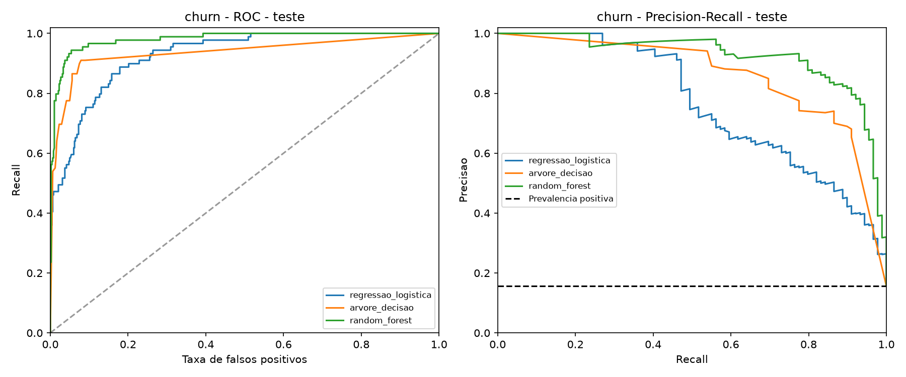
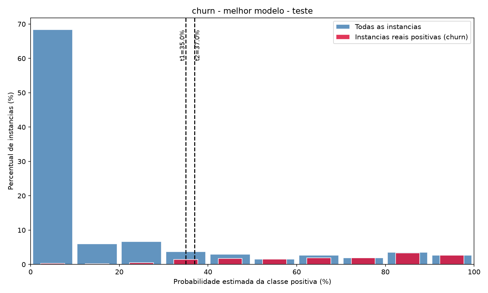
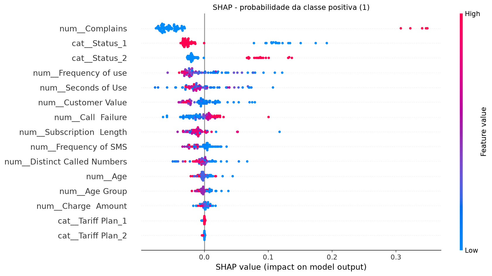
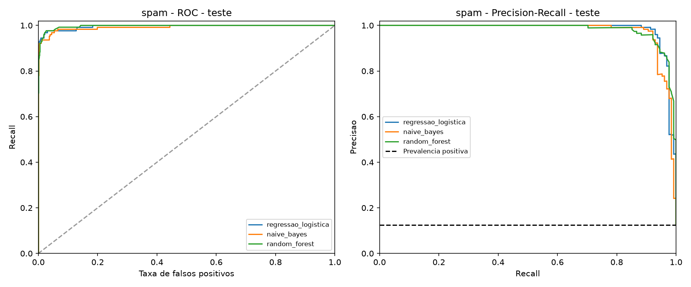
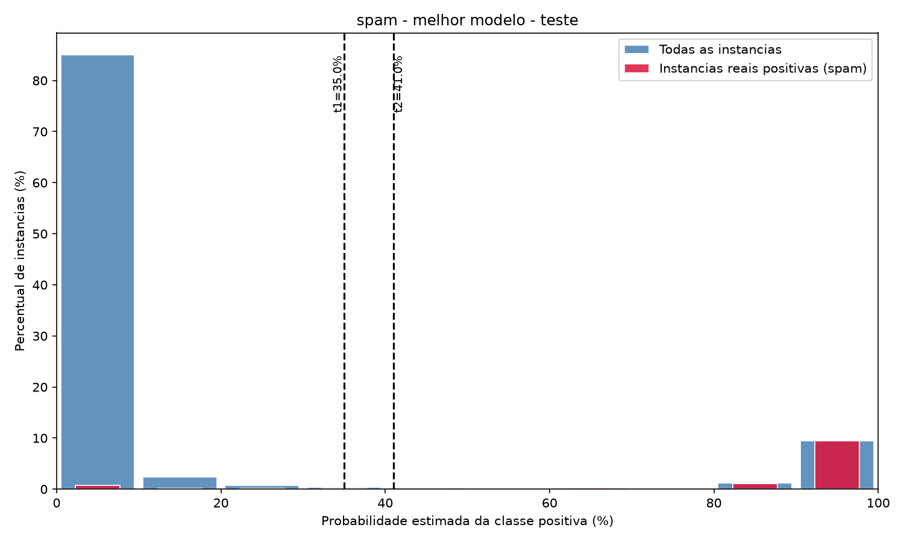
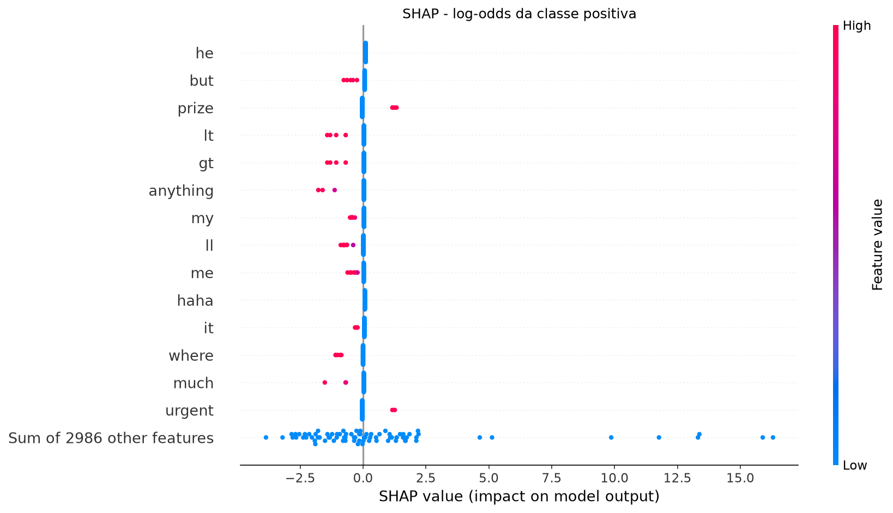
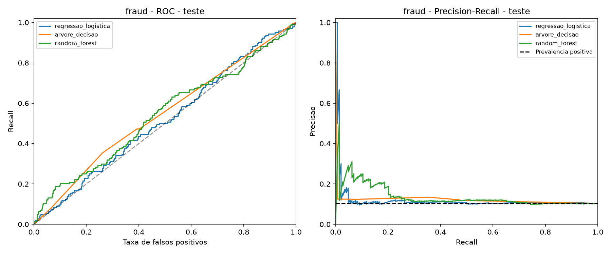
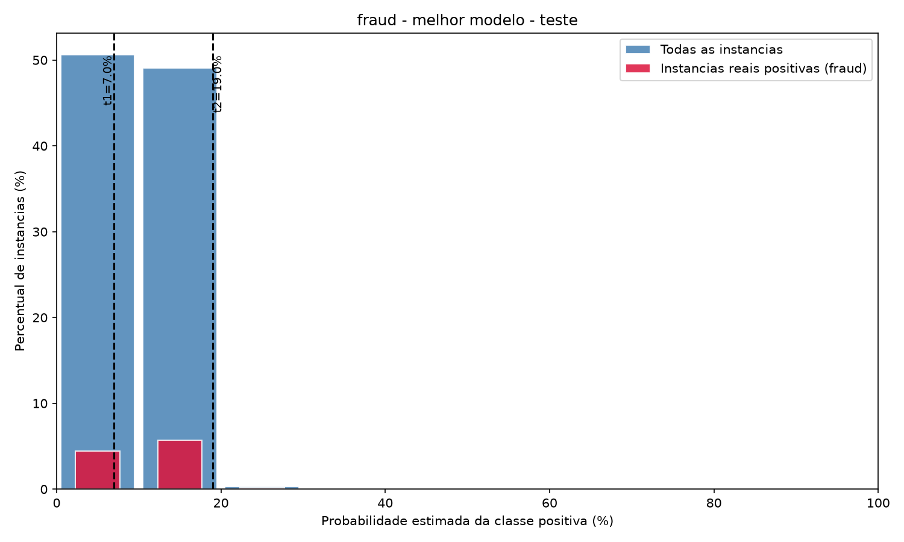
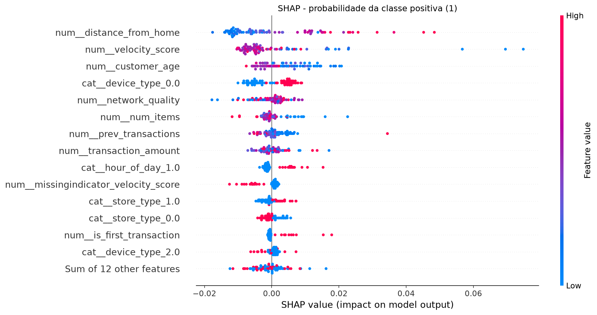

# A2 - metodologia e resultados para revisão da equipe

Este documento reúne resultados efetivamente calculados, como base para a
redação do relatório. Falta confirmar a origem/versão exata de `spam.csv`,
completar a identificação da equipe e revisar as interpretações. Fontes e
licenças estão em [FONTES_E_LICENCAS.md](FONTES_E_LICENCAS.md).

## Objetivo e desenho experimental

Foram estudados três problemas binários: cancelamento em telecomunicações,
mensagens spam e fraude sintética. A classe positiva é codificada como 1.
A base bancária inicialmente considerada foi substituída por Iranian Churn
por falta de uma licença explícita na fonte original.

Após remover duplicatas, cada base foi dividida em aproximadamente 60% para
treino, 20% para validação e 20% para teste, com estratificação e semente 42.
Hiperparâmetros foram otimizados com GridSearchCV e três folds estratificados
apenas no treino. Os resultados da validação definiram o melhor algoritmo e
os dois cortes. Não houve retreinamento após essa seleção. As métricas e
figuras finais abaixo usam exclusivamente o teste reservado.

Nas tabelas numéricas foram usados imputação por mediana, indicadores de
ausência e padronização; nas categóricas, imputação pela moda e One-Hot
Encoding. Todos os ajustes foram feitos dentro do pipeline de cada fold.
No SMS, o texto foi representado por TF-IDF com até 3.000 termos, sublinear TF
e n-gramas escolhidos pela validação cruzada. Trechos em colunas sem nome
foram reunidos ao texto. Foram removidas repetições após normalizar caixa e
espaços para comparação, preservando o texto utilizado como entrada.

## Métricas e justificativa

A métrica principal de seleção foi Average Precision (AP) nos três domínios,
pois as classes positivas são minoritárias e interessa recuperar positivos
mantendo precisão. No churn, falsos negativos representam oportunidades de
retenção perdidas e falsos positivos podem gerar contatos desnecessários. No
spam, um falso positivo pode ocultar uma mensagem legítima. Na fraude, falsos
negativos podem deixar transações suspeitas passarem e falsos positivos geram
alertas indevidos. AP permite avaliar a ordenação sem escolher antecipadamente
um único limiar; não incorpora diretamente custos financeiros ou operacionais.

Acurácia mede a fração total de acertos. Precisão é TP/(TP+FP), recall é
TP/(TP+FN) e F1 é a média harmônica de precisão e recall. Todas as métricas de
decisão e matrizes abaixo usam **probabilidade >= 0,50** para classe positiva.
Se o modelo não prevê positivos, a precisão é indefinida; o programa registra
0 por convenção (`zero_division=0`), o que deve ser explicitado na leitura.

As curvas ROC e PR são construídas variando o limiar sobre as probabilidades.
ROC representa recall versus FP/(FP+TN); PR representa precisão versus recall.
AUC-ROC e AUC-PR trapezoidal são áreas por integração; no código, AUC-ROC usa
`roc_auc_score` e AUC-PR usa `auc(recall, precision)`. AP usa a soma dos incrementos
de recall ponderados pela precisão, sem interpolação trapezoidal. Por isso as
duas medidas PR aparecem em colunas diferentes. A prevalência positiva serve
como referência para interpretar a curva PR; ROC próxima de 0,50 sugere pouca
capacidade de ordenação.

## Política das três faixas

Foram adotados limites **didáticos**, sem alegar que são exigências de uma
empresa: churn permite até 15% de FN automáticos entre positivos e 10% de FP
automáticos entre negativos; spam, 10% e 0,5%; fraude, 5% e 1%. A política mais
restritiva para FP em spam reflete o custo de bloquear mensagens legítimas;
o limite mais restritivo de FN em fraude reflete o risco de deixar fraudes
passarem. Esses limites precisam ser discutidos e defendidos pela equipe.

Na validação, o programa buscou pares em uma grade de 0 a 1, com passos de
0,01 e pontos adicionais 0,001/0,999. Entre pares que respeitam os limites,
maximizou a cobertura automática; empatando, preferiu menor soma das duas
taxas de erro, menor t1 e maior t2. No teste, p<t1 implica negativo automático;
t1<=p<t2 implica revisão manual; p>=t2 implica positivo automático.
Os limites de validação não são garantias para dados novos. Não se alteraram
os cortes após observar o teste.

Os histogramas usam intervalos de dez pontos percentuais. As barras azuis
representam todos os casos e as vermelhas os positivos reais, ambas divididas
pelo total de casos do teste. A soma azul é 100%; a soma vermelha é a prevalência
positiva, e não 100%.

## Churn em telecomunicações - UCI

Foram utilizadas 2850 das 3150 linhas, com remoção de 300 duplicatas. Essa decisão define a população avaliada como registros distintos e pode alterar a prevalência em relação ao CSV original.

| Conjunto | Classe | Quantidade | % no conjunto |
| --- | --- | --- | --- |
| teste | 0 | 481 | 84.39% |
| teste | 1 | 89 | 15.61% |
| treino | 0 | 1442 | 84.33% |
| treino | 1 | 268 | 15.67% |
| validacao | 0 | 481 | 84.39% |
| validacao | 1 | 89 | 15.61% |

### Comparação no desenvolvimento

| Modelo | AP média CV | AP validação |
| --- | --- | --- |
| regressao_logistica | 0.7628 | 0.7577 |
| arvore_decisao | 0.7888 | 0.8148 |
| random_forest | 0.9049 | 0.9378 |

Modelo selecionado: **random_forest**. Hiperparâmetros escolhidos: `{"modelo__max_depth": 8, "modelo__min_samples_leaf": 1}`. Random forests usam 150 árvores em dados tabulares e 100 em texto; regressão logística usa no máximo 2.000 iterações. As grades completas e resultados por fold estão nos arquivos `cv_*.csv`.

### Avaliação final no teste (limiar 0,50)

| Modelo | Acurácia | Precisão | Recall | F1 | AUC-ROC | AUC-PR trap. | AP |
| --- | --- | --- | --- | --- | --- | --- | --- |
| regressao_logistica | 0.9000 | 0.7857 | 0.4944 | 0.6069 | 0.9275 | 0.7621 | 0.7632 |
| arvore_decisao | 0.9281 | 0.7353 | 0.8427 | 0.7853 | 0.9359 | 0.8579 | 0.8164 |
| random_forest | 0.9491 | 0.9286 | 0.7303 | 0.8176 | 0.9806 | 0.9211 | 0.9215 |

| Modelo | TN | FP | FN | TP |
| --- | --- | --- | --- | --- |
| regressao_logistica | 469 | 12 | 45 | 44 |
| arvore_decisao | 454 | 27 | 14 | 75 |
| random_forest | 476 | 5 | 24 | 65 |

### Faixas no teste

Cortes congelados: **t1=0.35, t2=0.37**. Na validação, cobertura automática de 100.00%, FN automáticos/positivos de 11.24% e FP automáticos/negativos de 2.70%.

| Faixa | N | % população | Positivos | Negativos | % positivos na faixa | % negativos na faixa |
| --- | --- | --- | --- | --- | --- | --- |
| Classificacao negativa automatica | 476 | 83.51% | 11 | 465 | 2.31% | 97.69% |
| Analise manual | 5 | 0.88% | 2 | 3 | 40.00% | 60.00% |
| Classificacao positiva automatica | 89 | 15.61% | 76 | 13 | 85.39% | 14.61% |

Cobertura automática: 99.12%. Revisão manual: 0.88%. FN automáticos: 11/89 positivos reais (12.36%). FP automáticos: 13/481 negativos reais (2.70%).

### Explicação SHAP

Saída explicada: **probabilidade da classe positiva (1)**. Método: PermutationExplainer (5 ciclos; TreeExplainer falhou na verificacao de aditividade). Foram explicados 80 exemplos do teste, escolhidos aleatoriamente com semente fixa, usando 40 registros do treino como referência. Cada ponto é uma instância; vermelho indica valor alto e azul, baixo. SHAP positivo aumenta a saída explicada em relação à referência, e negativo a reduz. Essas associações descrevem o modelo e não demonstram causalidade.

No beeswarm, reclamações elevam a probabilidade prevista de cancelamento; ausência de reclamações tende a reduzi-la. Status não ativo contribui positivamente e status ativo negativamente. Frequência de uso baixa aparece associada a maior saída do modelo em muitos exemplos. Conforme a UCI, status e demais atributos pertencem aos primeiros nove meses, anteriores ao alvo no mês 12. A floresta teve maior AP de validação e AP de teste do que os outros dois algoritmos; a árvore obteve recall maior em 0,50, evidenciando que o modelo escolhido depende da métrica principal.

## Spam

Foram utilizadas 5157 das 5572 linhas, com remoção de 415 duplicatas. Essa decisão define a população avaliada como registros distintos e pode alterar a prevalência em relação ao CSV original.

| Conjunto | Classe | Quantidade | % no conjunto |
| --- | --- | --- | --- |
| teste | 0 | 904 | 87.60% |
| teste | 1 | 128 | 12.40% |
| treino | 0 | 2708 | 87.55% |
| treino | 1 | 385 | 12.45% |
| validacao | 0 | 903 | 87.50% |
| validacao | 1 | 129 | 12.50% |

### Comparação no desenvolvimento

| Modelo | AP média CV | AP validação |
| --- | --- | --- |
| regressao_logistica | 0.9632 | 0.9826 |
| naive_bayes | 0.9636 | 0.9886 |
| random_forest | 0.9558 | 0.9769 |

Modelo selecionado: **naive_bayes**. Hiperparâmetros escolhidos: `{"modelo__alpha": 0.1, "prep__ngram_range": [1, 1]}`. Random forests usam 150 árvores em dados tabulares e 100 em texto; regressão logística usa no máximo 2.000 iterações. As grades completas e resultados por fold estão nos arquivos `cv_*.csv`.

### Avaliação final no teste (limiar 0,50)

| Modelo | Acurácia | Precisão | Recall | F1 | AUC-ROC | AUC-PR trap. | AP |
| --- | --- | --- | --- | --- | --- | --- | --- |
| regressao_logistica | 0.9826 | 1.0000 | 0.8594 | 0.9244 | 0.9957 | 0.9825 | 0.9825 |
| naive_bayes | 0.9855 | 0.9913 | 0.8906 | 0.9383 | 0.9925 | 0.9751 | 0.9751 |
| random_forest | 0.9738 | 0.9903 | 0.7969 | 0.8831 | 0.9966 | 0.9814 | 0.9809 |

| Modelo | TN | FP | FN | TP |
| --- | --- | --- | --- | --- |
| regressao_logistica | 904 | 0 | 18 | 110 |
| naive_bayes | 903 | 1 | 14 | 114 |
| random_forest | 903 | 1 | 26 | 102 |

### Faixas no teste

Cortes congelados: **t1=0.35, t2=0.41**. Na validação, cobertura automática de 100.00%, FN automáticos/positivos de 6.98% e FP automáticos/negativos de 0.44%.

| Faixa | N | % população | Positivos | Negativos | % positivos na faixa | % negativos na faixa |
| --- | --- | --- | --- | --- | --- | --- |
| Classificacao negativa automatica | 911 | 88.28% | 10 | 901 | 1.10% | 98.90% |
| Analise manual | 4 | 0.39% | 3 | 1 | 75.00% | 25.00% |
| Classificacao positiva automatica | 117 | 11.34% | 115 | 2 | 98.29% | 1.71% |

Cobertura automática: 99.61%. Revisão manual: 0.39%. FN automáticos: 10/128 positivos reais (7.81%). FP automáticos: 2/904 negativos reais (0.22%).

### Explicação SHAP

Saída explicada: **log-odds da classe positiva; SHAP positivo aumenta a probabilidade da classe 1**. Método: LinearExplainer. Foram explicados 80 exemplos do teste, escolhidos aleatoriamente com semente fixa, usando 40 registros do treino como referência. Cada ponto é uma instância; vermelho indica valor alto e azul, baixo. SHAP positivo aumenta a saída explicada em relação à referência, e negativo a reduz. Essas associações descrevem o modelo e não demonstram causalidade.

O SHAP explica os log-odds do Naive Bayes, não probabilidades diretamente. Valores TF-IDF altos de termos como `prize` e `urgent` contribuem para spam; termos como `but` e `anything` contribuem no sentido oposto na amostra. Ausência de um termo também tem contribuição em relação à referência. Artefatos como `lt`/`gt` mostram uma limitação da representação textual. O Naive Bayes venceu na validação; a regressão logística teve AP maior no teste, mas isso não autoriza trocar o vencedor usando o teste.

## Fraude sintética

Foram utilizadas 7000 das 7000 linhas, com remoção de 0 duplicatas. Essa decisão define a população avaliada como registros distintos e pode alterar a prevalência em relação ao CSV original.

| Conjunto | Classe | Quantidade | % no conjunto |
| --- | --- | --- | --- |
| teste | 0 | 1256 | 89.71% |
| teste | 1 | 144 | 10.29% |
| treino | 0 | 3767 | 89.69% |
| treino | 1 | 433 | 10.31% |
| validacao | 0 | 1256 | 89.71% |
| validacao | 1 | 144 | 10.29% |

### Comparação no desenvolvimento

| Modelo | AP média CV | AP validação |
| --- | --- | --- |
| regressao_logistica | 0.1127 | 0.1242 |
| arvore_decisao | 0.1099 | 0.1103 |
| random_forest | 0.1089 | 0.1252 |

Modelo selecionado: **random_forest**. Hiperparâmetros escolhidos: `{"modelo__max_depth": 8, "modelo__min_samples_leaf": 5}`. Random forests usam 150 árvores em dados tabulares e 100 em texto; regressão logística usa no máximo 2.000 iterações. As grades completas e resultados por fold estão nos arquivos `cv_*.csv`.

### Avaliação final no teste (limiar 0,50)

| Modelo | Acurácia | Precisão | Recall | F1 | AUC-ROC | AUC-PR trap. | AP |
| --- | --- | --- | --- | --- | --- | --- | --- |
| regressao_logistica | 0.5350 | 0.1070 | 0.4792 | 0.1749 | 0.5187 | 0.1191 | 0.1214 |
| arvore_decisao | 0.8971 | 0.0000 | 0.0000 | 0.0000 | 0.5451 | 0.1219 | 0.1156 |
| random_forest | 0.8971 | 0.0000 | 0.0000 | 0.0000 | 0.5430 | 0.1348 | 0.1387 |

| Modelo | TN | FP | FN | TP |
| --- | --- | --- | --- | --- |
| regressao_logistica | 680 | 576 | 75 | 69 |
| arvore_decisao | 1256 | 0 | 144 | 0 |
| random_forest | 1256 | 0 | 144 | 0 |

### Faixas no teste

Cortes congelados: **t1=0.07, t2=0.19**. Na validação, cobertura automática de 7.29%, FN automáticos/positivos de 3.47% e FP automáticos/negativos de 0.48%.

| Faixa | N | % população | Positivos | Negativos | % positivos na faixa | % negativos na faixa |
| --- | --- | --- | --- | --- | --- | --- |
| Classificacao negativa automatica | 104 | 7.43% | 12 | 92 | 11.54% | 88.46% |
| Analise manual | 1285 | 91.79% | 130 | 1155 | 10.12% | 89.88% |
| Classificacao positiva automatica | 11 | 0.79% | 2 | 9 | 18.18% | 81.82% |

Cobertura automática: 8.21%. Revisão manual: 91.79%. FN automáticos: 12/144 positivos reais (8.33%). FP automáticos: 9/1256 negativos reais (0.72%).

### Explicação SHAP

Saída explicada: **probabilidade da classe positiva (1)**. Método: TreeExplainer. Foram explicados 80 exemplos do teste, escolhidos aleatoriamente com semente fixa, usando 40 registros do treino como referência. Cada ponto é uma instância; vermelho indica valor alto e azul, baixo. SHAP positivo aumenta a saída explicada em relação à referência, e negativo a reduz. Essas associações descrevem o modelo e não demonstram causalidade.

Distâncias maiores tendem a aumentar a probabilidade prevista; distâncias menores a reduzem. Valores altos de `velocity_score` e idade aparecem frequentemente com contribuição negativa nesta amostra, enquanto alguns valores baixos contribuem positivamente. Esses padrões pertencem a um modelo fraco em dados sintéticos e não devem ser tratados como regras reais de fraude. A floresta em 0,50 classificou todos os casos do teste como negativos: sua acurácia coincide com a proporção majoritária, e o recall é zero. Os cortes reduzem os erros automáticos ao custo de revisar quase toda a população. A taxa de FN automáticos no teste ultrapassou o limite didático de 5% usado na validação; os cortes foram preservados. A baixa precisão entre os positivos automáticos também mostra que limitar FP pelo total de negativos não garante alertas confiáveis.

## Limitações e conclusão

Os resultados foram obtidos em uma única divisão externa e uma busca pequena
de hiperparâmetros; não representam uma comparação exaustiva de algoritmos.
As probabilidades não foram calibradas. Os cortes foram escolhidos na mesma
validação que selecionou o modelo, o que pode gerar otimismo no desenvolvimento;
o teste separado permite observar essa diferença sem reajustar a política.

Na UCI, linhas idênticas podem representar clientes distintos: a remoção
conservadora evita repetição entre partições, mas muda a população e merece
discussão. As explicações SHAP usam amostras pequenas e referência do treino.
No churn foi necessário usar SHAP por permutação, uma aproximação com cinco
ciclos; verificou-se a reconstrução da saída do modelo, o que não equivale a
provar estabilidade das contribuições individuais. Características correlatas,
como idade/grupo etário e indicadores one-hot, também afetam as atribuições.

Churn e spam apresentaram boa discriminação neste experimento. Fraude mostrou
que acurácia alta pode coexistir com recall nulo e que a revisão manual pode
dominar a política quando o modelo tem pouco poder de separação. O programa
de cortes permite quantificar esse compromisso, sem confundir probabilidades
previstas com a classe real nem esconder os denominadores dos erros.

Antes da entrega: confirmar a origem/licença do CSV de spam, revisar o texto
com a equipe, explicar os limites didáticos e preparar a defesa individual.
Não incluir o antigo CSV bancário nem a pasta `resultados/churn` na entrega.
